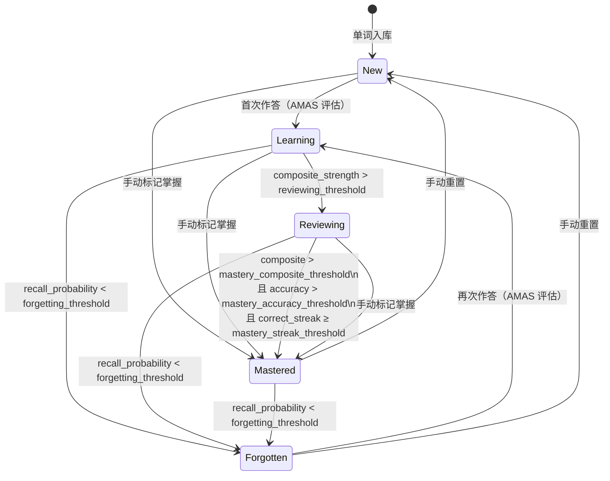

# 单词状态机

每个用户-单词对都维护一条独立的学习状态记录（`WordLearningState`），其核心是一个五态枚举 `WordState`。状态由 AMAS 引擎在每次答题后自动计算，也支持手动覆盖。

## 状态枚举

| 状态 | wire 值 | DB 值 | 含义 |
|------|---------|-------|------|
| `New` | `new` | `NEW` | 尚未作答，首次接触 |
| `Learning` | `learning` | `LEARNING` | 已作答，但记忆强度尚低 |
| `Reviewing` | `reviewing` | `REVIEWING` | 记忆趋于稳定，进入周期复习阶段 |
| `Mastered` | `mastered` | `MASTERED` | 达到掌握阈值，复习频率大幅降低 |
| `Forgotten` | `forgotten` | `FORGOTTEN` | 回忆概率跌破遗忘线，需重新学习 |

> **序列化说明**：wire 层（HTTP JSON）一律小写（`#[serde(rename_all = "lowercase")]`，commit d0325f8）；数据库层仍用大写（`as_str` / `from_str` 双向转换），两者通过代码隔离，互不影响。

## 状态图



## 状态转换触发条件

### 自动转换（AMAS 引擎）

每次答题后，`src/amas/memory/mastery.rs` 的 `determine_level()` 函数按以下优先级判定新状态：

1. **`total_attempts == 0`** → `New`（从未作答）
2. **掌握条件**（同时满足三项）→ `Mastered`
   - `composite_strength > mastery_composite_threshold`（默认 0.30）
   - `accuracy > mastery_accuracy_threshold`（默认 0.65）
   - `correct_streak ≥ mastery_streak_threshold`（默认 1 次连续正确）
3. **遗忘条件** → `Forgotten`
   - `recall_probability < forgetting_threshold`（默认值见 `amas_config.toml`）
4. **复习条件** → `Reviewing`
   - `composite_strength > reviewing_threshold`（默认 0.4）
5. 其余情况 → `Learning`

`composite_strength` 由 FSRS-5 的稳定性（stability）归一化得到：`(stability / 30.0).clamp(0.0, 1.0)`。`recall_probability` 通过幂律遗忘曲线计算，随时间衰减。

### 手动转换（API）

| 操作 | 接口 | 结果状态 |
|------|------|----------|
| 标记已掌握 | `POST /api/v0/word-states/:word_id/mark-mastered` | `Mastered`，`mastery_level = 1.0` |
| 重置单词 | `POST /api/v0/word-states/:word_id/reset` | `New`，所有计数归零 |
| 批量覆盖 | `POST /api/v0/word-states/batch-update` | 任意目标状态（由请求体指定） |

手动操作**绕过** AMAS 引擎直接写库，不重新计算记忆参数。

## 与 AMAS 的关系

AMAS 引擎在处理每个答题事件后，将 `MasteryLevel`（AMAS 内部枚举）映射到 `WordState`（持久化枚举），两者一一对应：

```
MasteryLevel::New       → WordState::New
MasteryLevel::Learning  → WordState::Learning
MasteryLevel::Reviewing → WordState::Reviewing
MasteryLevel::Mastered  → WordState::Mastered
MasteryLevel::Forgotten → WordState::Forgotten
```

**`Reviewing → Mastered` 的掌握阈值**由 AMAS 配置（`amas_config.toml` 的 `[memoryModel]` 节）控制，可通过管理后台热更新，无需重启服务。关键参数：

| 参数 | 默认值 | 说明 |
|------|--------|------|
| `mastery_composite_threshold` | 0.30 | composite_strength 下限 |
| `mastery_accuracy_threshold` | 0.65 | 近期作答准确率下限 |
| `mastery_streak_threshold` | 1 | 最低连续正确次数 |
| `reviewing_threshold` | 0.40 | 进入 Reviewing 的 composite_strength 下限 |
| `forgetting_threshold` | 见配置 | 回忆概率跌破此值则标记 Forgotten |

`Mastered` 词仍会被纳入复习队列，但 `WordSelector` 对回忆概率高于 `recall_mastered_threshold` 的词大幅压低选词分数（`score = 0.001`），实际复习频率显著降低。

## 相关数据字段

`WordLearningState` 除 `state` 外还携带以下字段，供调试和 AMAS 决策使用：

| 字段 | 类型 | 说明 |
|------|------|------|
| `mastery_level` | `f64 [0,1]` | AMAS 计算的连续掌握度 |
| `next_review_date` | `DateTime?` | 下次复习预计时间 |
| `half_life` | `f64` (小时) | 记忆半衰期估计 |
| `correct_streak` | `u32` | 当前连续正确次数（间隔 ≥ 30 min 才计） |
| `total_attempts` | `u32` | 历史总作答次数 |
